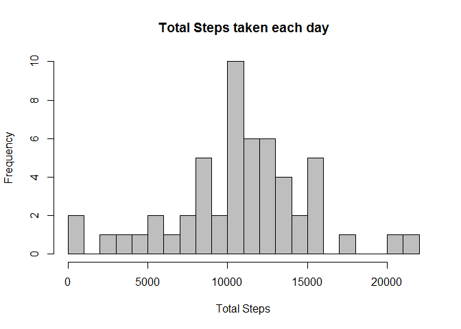
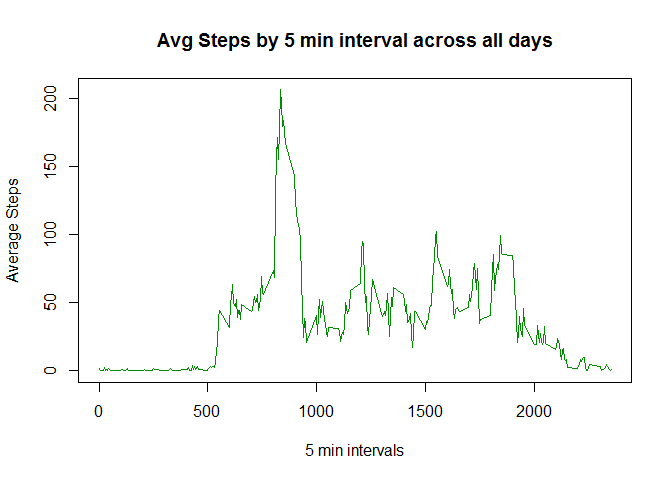
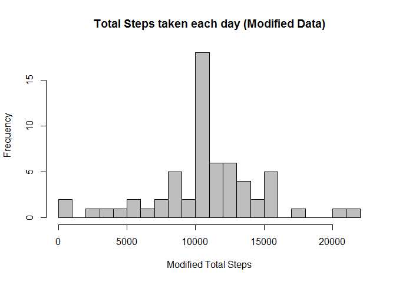
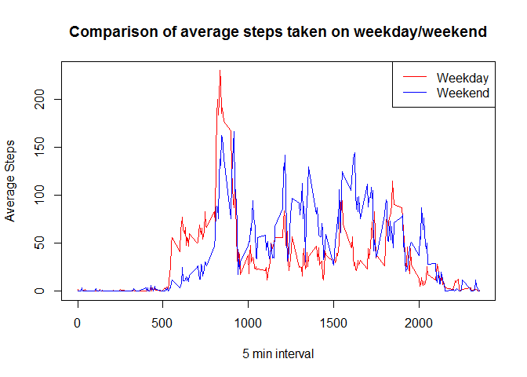

# Reproducible Research: Peer Assessment 1  

## Loading and preprocessing the data

Read the data from **activity.csv** file and remove the NA values.


```r
actdata <- read.csv(unz("./activity.zip","activity.csv"))
activity <-  subset(actdata, !is.na(actdata$steps))
head(activity)
```

```
##     steps       date interval
## 289     0 2012-10-02        0
## 290     0 2012-10-02        5
## 291     0 2012-10-02       10
## 292     0 2012-10-02       15
## 293     0 2012-10-02       20
## 294     0 2012-10-02       25
```

## What is mean total number of steps taken per day?


```r
library(dplyr)
```

```
## 
## Attaching package: 'dplyr'
## 
## The following objects are masked from 'package:stats':
## 
##     filter, lag
## 
## The following objects are masked from 'package:base':
## 
##     intersect, setdiff, setequal, union
```

```r
by_date <- group_by(activity, date)
StepsPerDay <- summarise(by_date,sum(steps))
StepsPerDay <- data.frame(StepsPerDay)
head(StepsPerDay)
```

```
##         date sum.steps.
## 1 2012-10-02        126
## 2 2012-10-03      11352
## 3 2012-10-04      12116
## 4 2012-10-05      13294
## 5 2012-10-06      15420
## 6 2012-10-07      11015
```

```r
hist(StepsPerDay$sum.steps., breaks = 20,col="grey", main="Total Steps taken each day", xlab = "Total Steps")
```

 
  
Mean of total steps taken each day

```r
summarise(StepsPerDay,mean(sum.steps.))
```

```
##   mean(sum.steps.)
## 1            10766
```
Median of total steps taken each day

```r
summarise(StepsPerDay,median(sum.steps.))
```

```
##   median(sum.steps.)
## 1              10765
```

## What is the average daily activity pattern?

```r
by_interval <- group_by(activity, interval)
StepsByInterval <- data.frame(summarise(by_interval,mean(steps)))
head(StepsByInterval)
```

```
##   interval mean.steps.
## 1        0     1.71698
## 2        5     0.33962
## 3       10     0.13208
## 4       15     0.15094
## 5       20     0.07547
## 6       25     2.09434
```

```r
with (StepsByInterval , plot(mean.steps.~interval, type = "l", col ="green4",main = "Avg Steps by 5 min interval across all days",xlab = "5 min intervals", ylab = "Average Steps"))
```

 
  
The 5 min interval with the highest total steps taken

```r
MaxStepsByInterval <- summarise(by_interval,sum(steps))
MaxStepsByInterval[which(MaxStepsByInterval[2] == max(MaxStepsByInterval[2])),"interval"]
```

```
## [1] 835
```

## Imputing missing values
The original dataset has missing values. Following is the count

```r
ModActData <- actdata
length(which(is.na(ModActData)))
```

```
## [1] 2304
```

The missing values in **steps** variable are replaced by the average steps taken for that interval.

```r
ValueList <- numeric(0)
for (i in ModActData$interval[is.na(ModActData$steps)])
    ValueList <- rbind (ValueList, StepsByInterval[(StepsByInterval$interval==i),2])

ModActData$ModSteps <- replace( ModActData$steps, is.na( ModActData$steps), ValueList)
ModActData <- ModActData[,-1]
head(ModActData)
```

```
##         date interval ModSteps
## 1 2012-10-01        0  1.71698
## 2 2012-10-01        5  0.33962
## 3 2012-10-01       10  0.13208
## 4 2012-10-01       15  0.15094
## 5 2012-10-01       20  0.07547
## 6 2012-10-01       25  2.09434
```

The total steps taken by each day from the modified dataset

```r
ByDate <- aggregate(.~date, FUN=sum,  data=ModActData)
hist(ByDate$ModSteps,breaks = 20,col="grey", main="Total Steps taken each day (Modified Data)", xlab = "Modified Total Steps")
```

 

The mean of the total steps taken by each day in modified dataset

```r
mean(ByDate$ModSteps)
```

```
## [1] 10766
```
The median of the total steps taken by each day in modified dataset

```r
median(ByDate$ModSteps)
```

```
## [1] 10766
```

## Are there differences in activity patterns between weekdays and weekends?
The dataset is further processed to include a factor variable indicating if the date is a weekday or weekend. 

```r
ModActData$date <- as.Date(ModActData$date,"%Y-%m-%d")
ModActDayData <- transform(ModActData,DayType = ifelse(weekdays(ModActData$date) %in% c("Saturday","Sunday"),"weekend","weekday" ))
head(ModActDayData)
```

```
##         date interval ModSteps DayType
## 1 2012-10-01        0  1.71698 weekday
## 2 2012-10-01        5  0.33962 weekday
## 3 2012-10-01       10  0.13208 weekday
## 4 2012-10-01       15  0.15094 weekday
## 5 2012-10-01       20  0.07547 weekday
## 6 2012-10-01       25  2.09434 weekday
```

Here a time series plot of 5 min interval and the average steps taken across all days. The following plot is a comparison between Weekday & Weekend data.


```r
ByWeekend <- aggregate(.~interval, FUN=mean,  data=ModActDayData[(ModActDayData$DayType =="weekend"), ])
ByWeekday <- aggregate(.~interval, FUN=mean,  data=ModActDayData[(ModActDayData$DayType =="weekday"), ])

plot(ByWeekday$ModSteps~ByWeekday$interval , type = "l", col ="red",main = "Comparison of average steps taken on weekday/weekend", xlab="5 min interval", ylab="Average Steps") 
lines(ByWeekend$ModSteps~ByWeekend$interval , type = "l", col ="blue1",) 
legend("topright",legend=c("Weekday","Weekend"),col=c("red","blue1"),lty=1)
```

 

